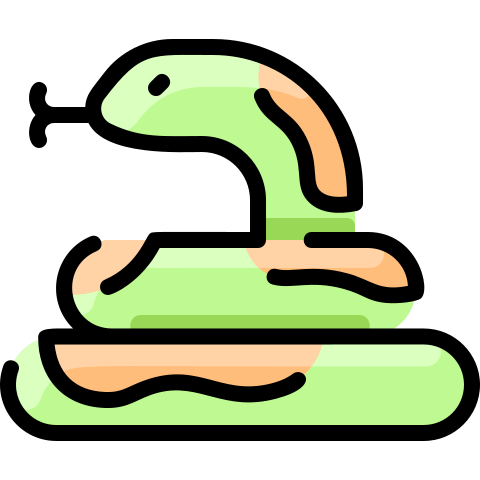
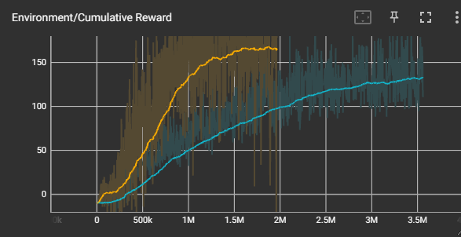

<a name="readme-top"></a>

<!-- PROJECT SHIELDS -->
[![Contributors][contributors-shield]][contributors-url]
[![Forks][forks-shield]][forks-url]
[![Stargazers][stars-shield]][stars-url]
[![Issues][issues-shield]][issues-url]
[![MIT License][license-shield]][license-url]

[//]: # ([![LinkedIn][linkedin-shield]][linkedin-url])

<!-- PROJECT LOGO -->
<br />

<div align="center">
<div class="title_logo">

  <a href="https://github.com/Pristar4/SnakeGame">

[//]: # (This is for the doxygen)

[//]: # (![logo]&#40;images/logo.png&#41;)


  </a>
</div>
<h3 align="center">SnakeGame - AI Edition</h3>

  <p align="center">
     Training an AI to play the classic Snake Game!
    <br />
    <a href="https://pristar4.github.io/SnakeGame"><strong>Explore the docs »</strong></a>
    <br />
    <br />
    <a href="https://github.com/Pristar4/SnakeGame">View Demo</a>
    ·
    <a href="https://github.com/Pristar4/SnakeGame/issues">Report Bug</a>
    ·
    <a href="https://github.com/Pristar4/SnakeGame/issues">Request Feature</a>
  </p>
</div>


<!-- TABLE OF CONTENTS -->
<details>
  <summary>Table of Contents</summary>
  <ol>
    <li>
      <a href="#about-the-project">About The Project</a>
      <ul>
        <li><a href="#built-with">Built With</a></li>
      </ul>
    </li>
    <li>
      <a href="#getting-started">Getting Started</a>
      <ul>
        <li><a href="#prerequisites">Prerequisites</a></li>
        <li><a href="#installation">Installation</a></li>
      </ul>
    </li>
    <li><a href="#usage">Usage</a></li>
    <li><a href="#roadmap">Roadmap</a></li>
    <li><a href="#contributing">Contributing</a></li>
    <li><a href="#license">License</a></li>
    <li><a href="#contact">Contact</a></li>
    <li><a href="#acknowledgments">Acknowledgments</a></li>
  </ol>
</details>


<!-- ABOUT THE PROJECT -->

## About The Project

<div class="title_screenshot">


</div>

This project is about making a sophisticated AI that can play the classic Snake Game efficiently.
The goal was not only to cultivate the AI's ability to survive in the game, but also to potentially
maximize the score that it can achieve.


<p align="right">(<a href="#readme-top">back to top</a>)</p>

### Built With

This section should list any major frameworks/libraries used to bootstrap your project.

* [![Unity][Unity.com]][Unity-url]
* [![DotNet.com][DotNet.com]][DotNet-url]

<p align="right">(<a href="#readme-top">back to top</a>)</p>


<!-- GETTING STARTED -->

## Getting Started

Due to the project being constructed in Unity, you would need to have Unity and IDE support for
Unity projects installed on your machine.

### Prerequisites

This is a list of things you need to use the software and how to install them.

Install the following software:

* [Unity](https://store.unity.com/download)
* [Python 3.11.4](https://www.python.org/downloads/release/python-3114/)

### Installation


Perform the following steps to set up and run the project:

1. Clone the repo

    ```
    git clone https://github.com/Pristar4/SnakeGame.git
    ```
2. Set up the virtual environment in the mk-agents folder under SnakeGame\ml-agents by running:

    ```
    python -m venv ./venv
    ```
3. Activate your virtual enviroment:

    ```
    .\venv\Scripts\activate
    ```
4. Install ML-agents:
    ```
    python.exe -m pip install --upgrade pip
    ```
5. Install torch:
    ```
    pip install torch -f https://download.pytorch.org/whl/torch_stable.html
    ```

6. Install Tensorflow

    ```
    pip install tensorflow
    ```
7. Install ml-agents-env

    ```
    pip install -e ./ml-agents-envs
    ```
8. Install ml-agents

    ```
    pip install -e ./ml-agents
    ```
9. install tensorboard

   ```
   pip install tensorboard
   ```
10. Start the training by running:

    ```
    mlagents-learn config/ppo/Snake.yaml --run-id=trainingRun01
    ```
11. start TensorBoard to monitor training:

    ```
    tensorboard --logdir results
    ```
12. Enter the Play mode in the Unity editor in the AI scene
    under

    ``SnakeGame\Assets\SnakeGame\_Levels\AI``

<p align="right">(<a href="#readme-top">back to top</a>)</p>


<!-- USAGE EXAMPLES -->

## Usage

Use this space to show useful examples of how a project can be used. Additional screenshots, code
examples and demos work well in this space. You may also link to more resources.

_For more examples, please refer to the [Documentation](https://github.com/Pristar4/SnakeGame)_

<p align="right">(<a href="#readme-top">back to top</a>)</p>


<!-- ROADMAP -->

## Roadmap

- [x] Working Prototype
- [x] Working ML-Agents implementation
- [ ] Refactor out of SnakeAgent as GameManger
- [ ] Player vs AI
- [ ] Support multiple Snakes
- [ ] Snake BattleRoyale / Match Handler

See the [open issues](https://github.com/Pristar4/SnakeGame/issues) for a full list of proposed
features (and known issues).

<p align="right">(<a href="#readme-top">back to top</a>)</p>


<!-- CONTRIBUTING -->

## Contributing

Contributions are what make the open source community such an amazing place to learn, inspire, and
create. Any contributions you make are greatly appreciated.

If you have a suggestion that would make this better, please fork the repo and create a pull
request. You can also simply open an issue with the tag "enhancement". Don't forget to give the
project a star! Thanks again!

1. Fork the Project
2. Create your Feature Branch (`git checkout -b feature/AmazingFeature`)
3. Commit your Changes (`git commit -m 'Add some AmazingFeature'`)
4. Push to the Branch (`git push origin feature/AmazingFeature`)
5. Open a Pull Request

<p align="right">(<a href="#readme-top">back to top</a>)</p>


<!-- LICENSE -->

## License

Distributed under the MIT License. See `LICENSE` for more information.

<p align="right">(<a href="#readme-top">back to top</a>)</p>


<!-- CONTACT -->

## Contact

Felix Jung - felix.j.jung@gmail.com

Project Link: [https://github.com/Pristar4/SnakeGame](https://github.com/Pristar4/SnakeGame)

<p align="right">(<a href="#readme-top">back to top</a>)</p>


<!-- ACKNOWLEDGMENTS -->

## Acknowledgments

* [Unity ML-Agents](https://github.com/Unity-Technologies/ml-agents)

* [Jetbrains Rider](https://www.jetbrains.com/rider/)
* [Best-README-Template](https://github.com/othneildrew/Best-README-Template)

<p align="right">(<a href="#readme-top">back to top</a>)</p>


<!-- MARKDOWN LINKS & IMAGES -->
<!-- https://www.markdownguide.org/basic-syntax/#reference-style-links -->

[contributors-shield]: https://img.shields.io/github/contributors/Pristar4/SnakeGame.svg?style=for-the-badge

[contributors-url]: https://github.com/Pristar4/SnakeGame/graphs/contributors

[forks-shield]: https://img.shields.io/github/forks/Pristar4/SnakeGame.svg?style=for-the-badge

[forks-url]: https://github.com/Pristar4/SnakeGame/network/members

[stars-shield]: https://img.shields.io/github/stars/Pristar4/SnakeGame.svg?style=for-the-badge

[stars-url]: https://github.com/Pristar4/SnakeGame/stargazers

[issues-shield]: https://img.shields.io/github/issues/Pristar4/SnakeGame.svg?style=for-the-badge

[issues-url]: https://github.com/Pristar4/SnakeGame/issues

[license-shield]: https://img.shields.io/github/license/Pristar4/SnakeGame.svg?style=for-the-badge

[license-url]: https://github.com/Pristar4/SnakeGame/blob/master/LICENSE.txt

[//]: # ([linkedin-shield]: https://img.shields.io/badge/-LinkedIn-black.svg?style=for-the-badge&logo=linkedin&colorB=555)

[//]: # ()

[//]: # ([linkedin-url]: https://linkedin.com/in/)

[product-screenshot]: images/screenshot.png

[Unity.com]: https://img.shields.io/badge/unity-black?style=for-the-badge&logo=unity

[Unity-url]: https://unity.com/

[DotNet.com]: https://img.shields.io/badge/C%23-black?style=for-the-badge&logo=dotnet

[DotNet-url]: https://dotnet.microsoft.com/
